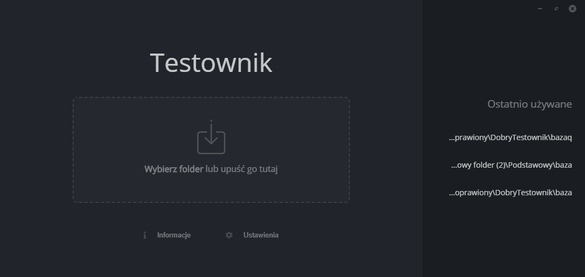
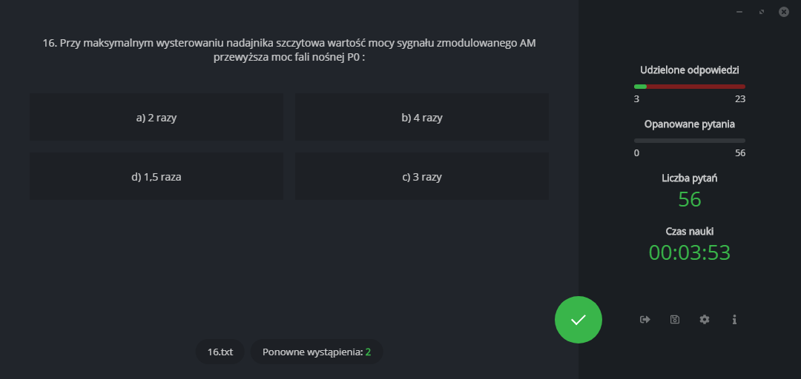
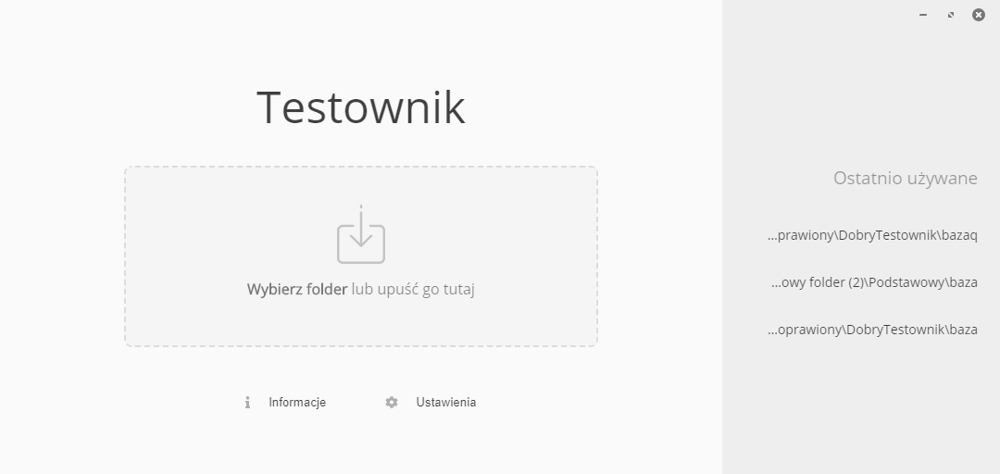
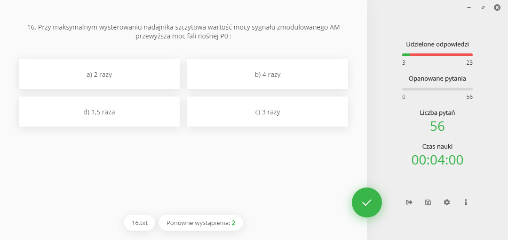
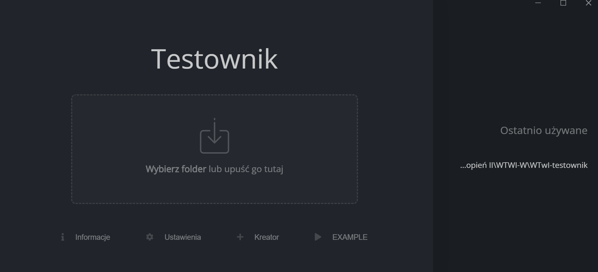
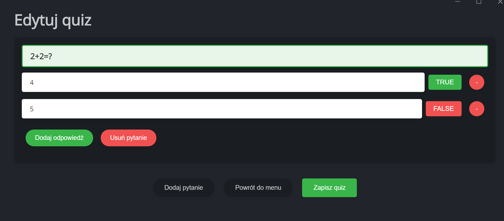

# Testownik

Testownik is an app for solving tests created by PWr students. This is redesigned version of classic Testownik app. It is powered by electron.js and vue.js

## Installation

You can download and install this app from [Releases page](https://github.com/kumalg/testownik-electron/releases). 

## Usage

### Keyboard Support
Testownik provided keyboard support while test is running. You can use <kbd>1</kbd> - <kbd>9</kbd> keys to select/unselect answer choices and <kbd>Space</kbd> key to accept answer.

### Sample Quiz
If You want to see sample quiz, press the **EXAMPLE** button after launch.


## Building for Windows

1. Install dependencies:
   ```powershell
   npm install
   ```
2. Build production app:
   ```powershell
   npm run build
   ```
   – produces NSIS installer & portable .exe in `build/`
3. (Optional) Unpacked dir only:
   ```powershell
   npm run build:dir
   ```
4. (Optional) Custom targets:
   ```powershell
   npx electron-builder --win --x64 --ia32
   ```

## Screenshots

Dark theme:



Light theme:



Main screen:


Quiz creator:

